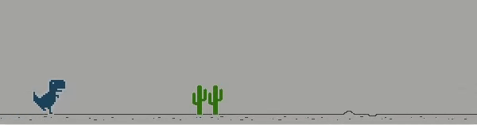
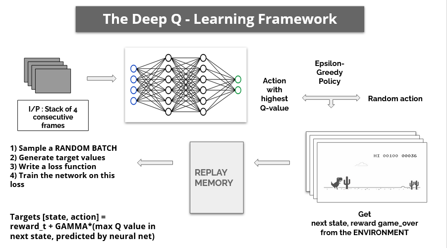
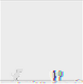
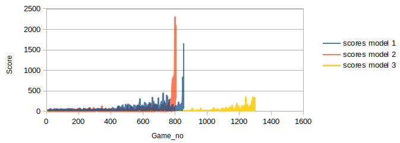
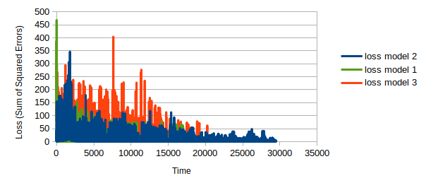
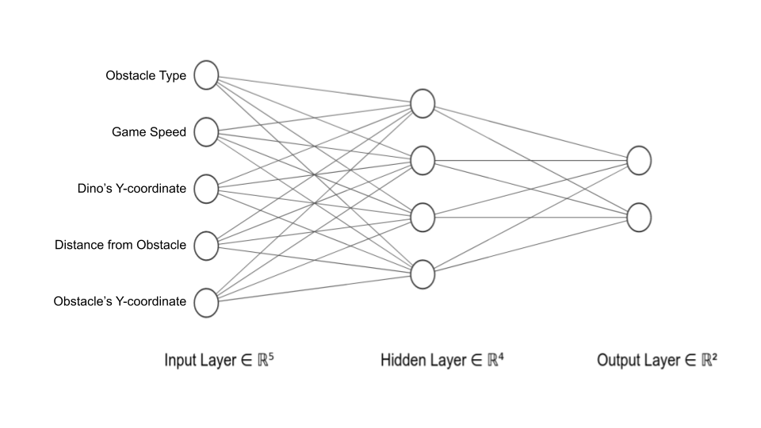
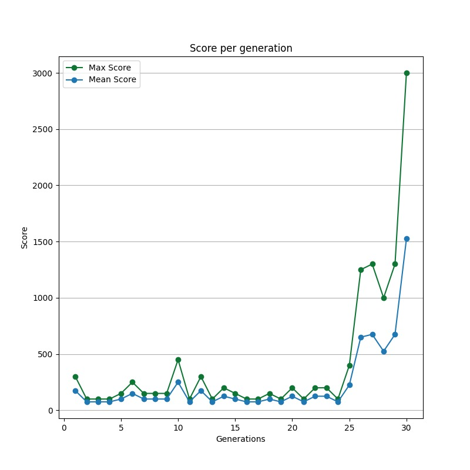
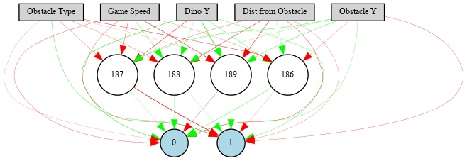

# DinoML | Reinforcement Learning and Neuroevolution on the Chrome Dino Game

<p align="center">

<br>Trained Model Gameplay
</div>
</p>

## Group Members
1. Ajinkya Pawar
2. Jitender Kumar
3. Pranshu Kumar Gond
4. Sagar Bisen

> This is our final project submission for the course **ES654 | Machine Learning** offered at IIT Gandhinagar, India. 

## Contents
  * [:pencil: Introduction](#introduction)
  * [:robot: Deep Q-Learning](#deep-q-learning)
    + [:clipboard: The Deep Q-Learning Framework](#the-deep-q-learning-framework)
    + [ :black_nib: Our contribution](#our-contribution)
      - [1. Environment Class](#1-environment-class)
      - [2. Redefining States](#2-redefining-states)
    + [:bar_chart: Results](#results)
  * [:robot: NEAT](#neat)
    + [:wrench: Hyperparameters](#hyperparameters)
    + [:pencil2: Gene (ANN) Structure](#gene--ann--structure)
    + [:page_with_curl: Method](#method)
    + [:bar_chart: Results](#results-1)
      - [1. *pygame* implementation of NEAT](#1--pygame--implementation-of-neat)
      - [2. Game with constant game speed](#2-game-with-constant-game-speed)
      - [3. Game with increasing game speed](#3-game-with-increasing-game-speed)
      - [4. Gene (ANN) of the winner genome](#4-gene--ann--of-the-winner-genome)
  * [:mag: References](#references)

---


## Introduction
In this project, we implement two of the widely used algorithms used in GVGP (General Video Game Playing) namely, **Deep Q-Learning** and **Neural Evolution of Augmenting Topologies (NEAT)** on the Chrome browser's Dino Run game. 

## Deep Q-Learning
To play Dino game using the trained model, simply run the `DinoPygameRL.ipynb` [file](ReinforcementLearning/DinoPygameRL.ipynb)

### The Deep Q-Learning Framework
<p align="center">

</div>
</p>

### Our contribution
#### 1. Environment Class
```python
class Environment():
    def __init__(self, param):
        # initialize player and obstacle objects, etc...
    def update(self, param):
        # update a single frame
    def render(self, param):
        # take some action in current state and go to next state
        # for a jump function, call update x times
        # for a run action, call update only once
        # return the next state, reward gameover flag 
```

#### 2. Redefining States
A state should be a snapshot of the game from which the Dino should be able to take one of the possible actions. So a Dino midway in air after a jump action, is not a state. We changed the code accordingly.

<p align="left">

<br>State before a jump action
</div>
</p>

<p align="left">

<br>State after a jump action
</div>
</p>

### Results

<p align="center">

<br> Evolution of score per game 
</div> 
</p>

<p align="center">

<br> Evolution of loss with time
</div> 
</p>

## NEAT
### Hyperparameters
<table>
<thead>
  <tr>
    <th class="tg-c3ow">Hyperparameter</th>
    <th class="tg-c3ow">Value</th>
  </tr>
</thead>
<tbody>
  <tr>
    <td class="tg-c3ow">Population Size</td>
    <td class="tg-c3ow">150</td>
  </tr>
  <tr>
    <td class="tg-c3ow">Number of Input Nodes</td>
    <td class="tg-c3ow">5</td>
  </tr>
  <tr>
    <td class="tg-c3ow">Number of Output Nodes</td>
    <td class="tg-c3ow">2</td>
  </tr>
  <tr>
    <td class="tg-c3ow">Number of Nodes in the Hidden Layer</td>
    <td class="tg-c3ow">4</td>
  </tr>
  <tr>
    <td class="tg-baqh">Activation Function</td>
    <td class="tg-baqh">sigmoid</td>
  </tr>
  <tr>
    <td class="tg-baqh">Elitism</td>
    <td class="tg-baqh">2</td>
  </tr>
  <tr>
    <td class="tg-baqh">Survival Threshold</td>
    <td class="tg-baqh">0.2</td>
  </tr>
</tbody>
</table>

### Gene (ANN) Structure
<p align="center">

</div>
</p>

### Method
We evaluated the NEAT algorithm on two models of the game,
1. The first model was a game with constant game speed.
2. The second model was a game with increasing game speed. 
> More details can be found in the [report](DinoML.pdf)
### Results
#### 1. *pygame* implementation of NEAT
<p align="center">

</div>
</p>


#### 2. Game with constant game speed
<p align="center">

<br>Score of the fittest genome in the generation
</div>
</p>

#### 3. Game with increasing game speed
<p align="center">

<br>Max Score - Score of the fittest genome in the generation
<br> Mean Score - Mean score of all the genomes in the generation
</div>
</p>

#### 4. Gene (ANN) of the winner genome
> Red arrows - Postive Correlation
> Green Arrows - Negative Correlation 
<p align="center">

<br>Gene (ANN) of the winner genome.
</div>
</p>

## References
1. https://github.com/codewmax/NEAT-ChromeDinosaur
2. https://github.com/Paperspace/DinoRunTutorial

