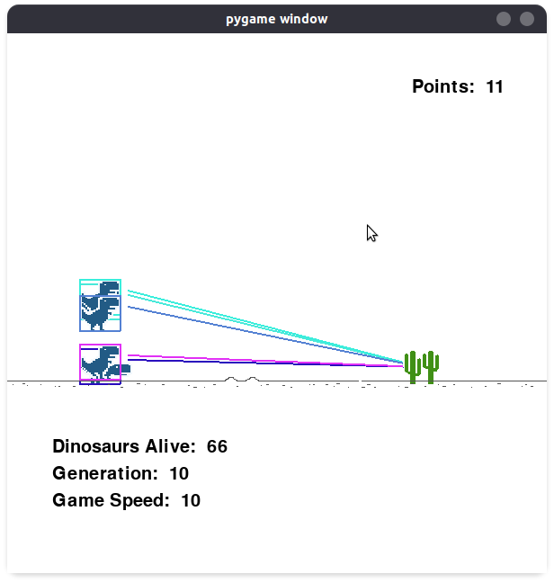
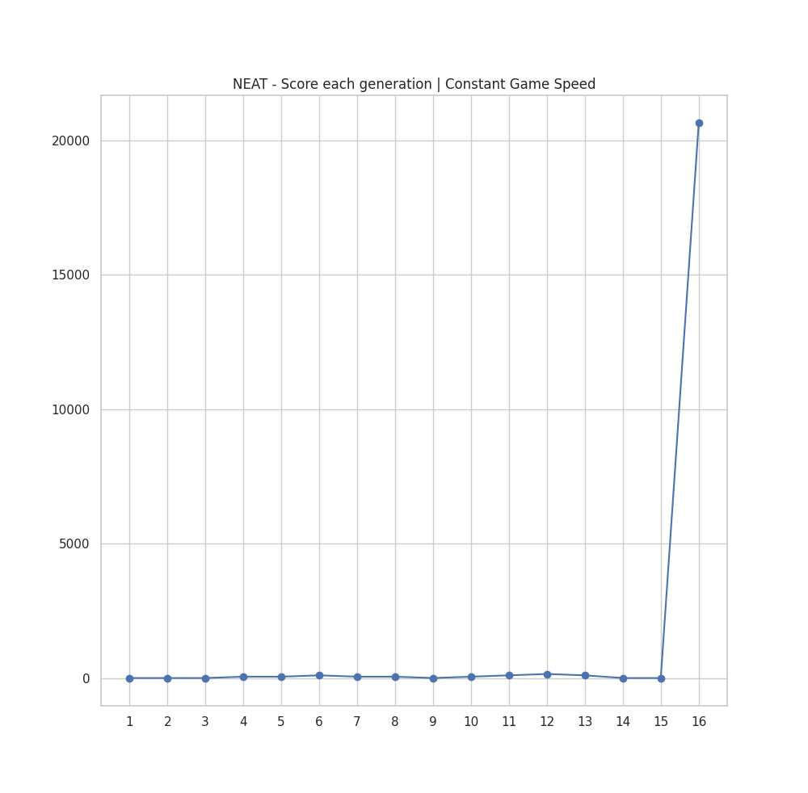

# DinoML | Reinforcement Learning and Neuroevolution on the Chrome Dino Game

 Chrome Dino Run Game

## Group Members
1. Ajinkya Pawar
2. Jitender Kumar
3. Pranshu Kumar Gond
4. Sagar Bisen

> This is our final project submission for the course **ES654 | Machine Learning** offered at IIT Gandhinagar, India. 

---

## Introduction
In this project, we implement two of the widely used algorithms used in GVGP (General Video Game Playing) namely, **Deep Q-Learning** and **Neural Evolution of Augmenting Topologies (NEAT)** on the Chrome browser's Dino Run game. 

## Deep Q-Learning
To play Dino game using the trained model, simply run the .ipynb file
### Our contribution
#### 1. Environment Class

## NEAT
### Hyperparameters
<table>
<thead>
  <tr>
    <th class="tg-c3ow">Hyperparameter</th>
    <th class="tg-c3ow">Value</th>
  </tr>
</thead>
<tbody>
  <tr>
    <td class="tg-c3ow">Population Size</td>
    <td class="tg-c3ow">150</td>
  </tr>
  <tr>
    <td class="tg-c3ow">Number of Input Nodes</td>
    <td class="tg-c3ow">5</td>
  </tr>
  <tr>
    <td class="tg-c3ow">Number of Output Nodes</td>
    <td class="tg-c3ow">2</td>
  </tr>
  <tr>
    <td class="tg-c3ow">Number of Nodes in the Hidden Layer</td>
    <td class="tg-c3ow">4</td>
  </tr>
  <tr>
    <td class="tg-baqh">Activation Function</td>
    <td class="tg-baqh">sigmoid</td>
  </tr>
  <tr>
    <td class="tg-baqh">Elitism</td>
    <td class="tg-baqh">2</td>
  </tr>
  <tr>
    <td class="tg-baqh">Survival Threshold</td>
    <td class="tg-baqh">0.2</td>
  </tr>
</tbody>
</table>

### Method
We evaluated the NEAT algorithm on two models of the game,
1. The first model was a game with constant game speed.
2. The second model was a game with increasing game speed. 
> More details can be found in the [report](DinoML.pdf)
### Results
#### 1. *pygame* implementation of NEAT

#### 2. Game with constant game speed

 Score of the fittest genome in the generation

#### 3. Game with increasing game speed

 Max Score - Score of the fittest genome in the generation
  Mean Score - Mean score of all the genomes in the generation

#### 4. Gene (ANN) of the winner genome
> Red arrows - Postive Correlation
> Green Arrows - Negative Correlation 

 Gene (ANN) of the winner genome.

## References
1. https://github.com/codewmax/NEAT-ChromeDinosaur
2. https://github.com/Paperspace/DinoRunTutorial

